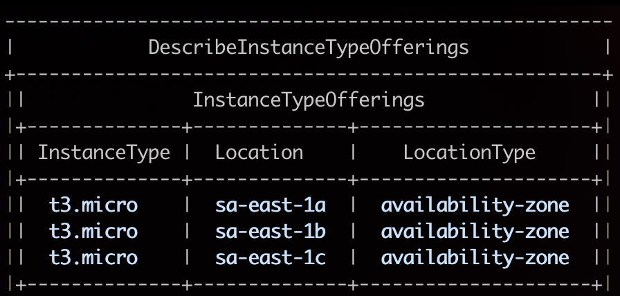
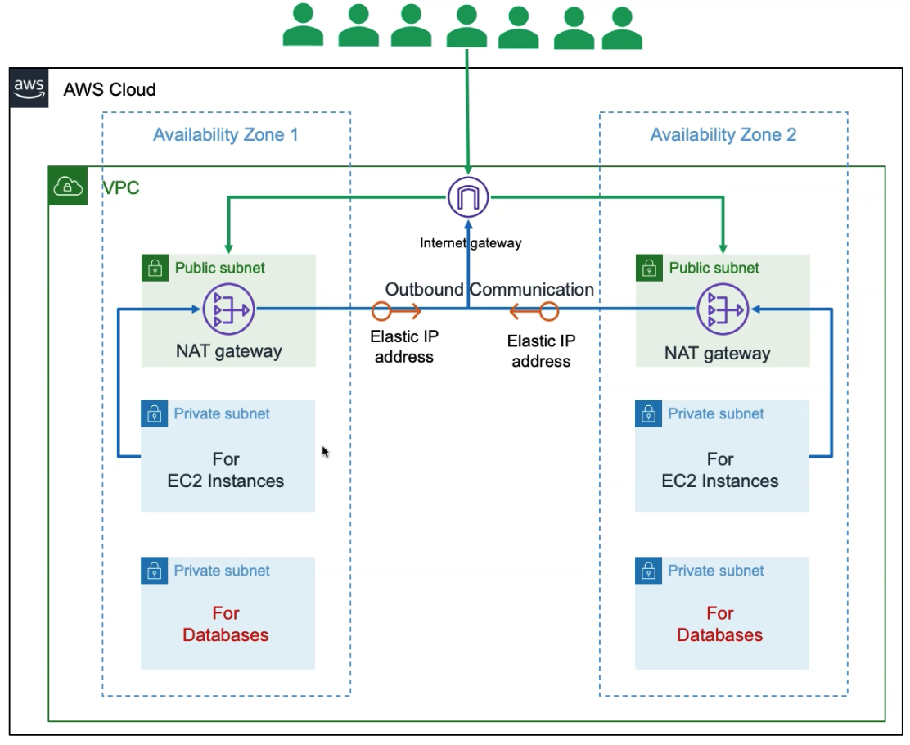
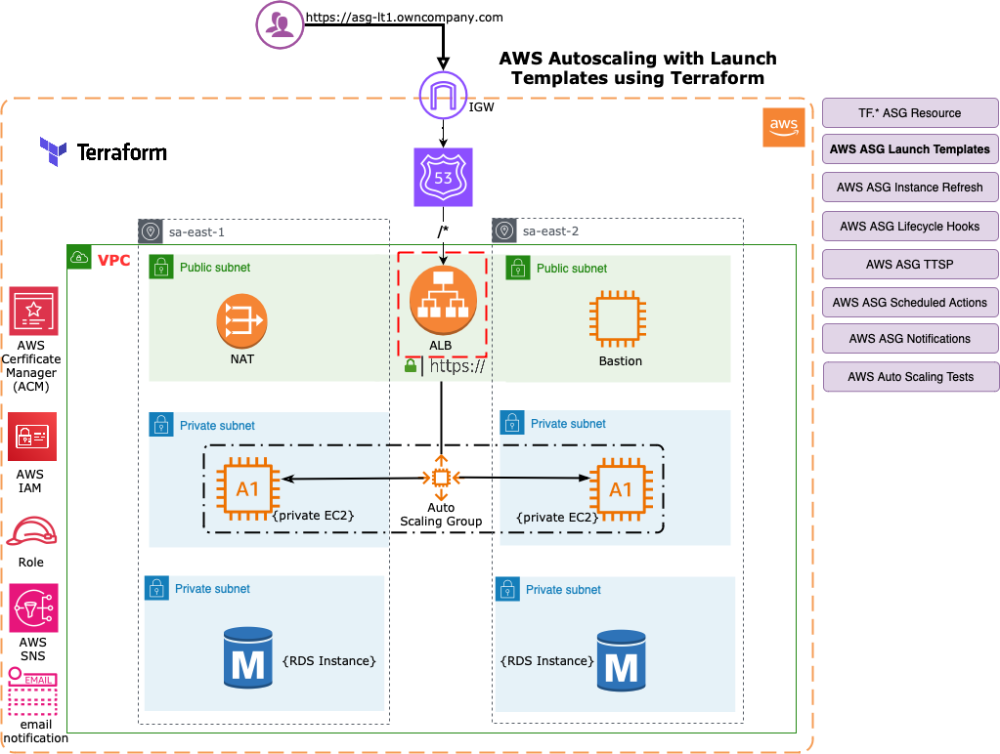

= Terraform on AWS with SRE & IaC DevOps

== Links

- https://github.com/stacksimplify/terraform-on-aws-ec2[Terraform on AWS EC2]
- https://github.com/stacksimplify/hashicorp-certified-terraform-associate[Hashicorp Certified Terraform]
- https://discuss.hashicorp.com/t/error-configuring-terraform-aws-provider-no-valid-credential-sources-for-terraform-aws-provider-found/35708/2[Error configuring Terraform AWS Provider: Downgrade TF Version]
- https://registry.terraform.io/browse/providers[Terraform providers]
- https://registry.terraform.io/browse/modules[Terraform Modules]
- https://developer.hashicorp.com/terraform/language[Terraform Language Documentation]
- https://registry.terraform.io/browse/modules[Terraform]

== Terraform Flow

.PEM Passphrase
[source,html]
----
passphrase certsign
----

[source,bash]
----
terraform init
terraform plan
terraform apply
terraform destroy
terraform validate
terraform plan -destroy
----

=== Terraform Block

* Special block used to configure some _behaviors_
* Within a terraform block, *_only constant values can be used_*; arguments may not refer to named objects such as resources, input variables, etc, and may not use any of the Terraform language built-in functions

.Loops & Meta-arguments - Section-05
[source,hcl-terraform]
----
variable "instance_type_list" {
  description = "EC2 Instance Type"
  type        = list(string)
  default     = ["t3.micro", "t3.small"]
}

data "aws_availability_zones" "az_zones" {
  filter {
    name = "opt-in-status"
    values = ["opt-in-not-required"]
  }
}

variable "instance_type_map" {
  description = "EC2 Instance Type"
  type        = map(string)
  default     = {
    "dev"   = "t3.micro"
    "qa"    = "t3.small"
    "prod"  = "t3.large"
  }
}

resource "aws_instance" "my_ec2_inst" {
  #count = 1
  instance_type = var.instance_type_list[count.index] # list
  # Create EC2 Instance in all Availability Zones of A VPC
  for_each = toset(data.aws_availability_zones.az_zones.names)
  availability_zone = each.key
  # Unique instance
  #instance_type = var.instance_type_map["prod"]
  # each.key for list items each.key == each.value
  tag = {
    "Name" = "for_each-demo-inst-${each.key}"
  }
}

resource "aws_instance" "my_ec2_inst_v1" {
  #count = 1
  instance_type = var.instance_type_list[count.index] # list
  # Create EC2 Instance in all Availability Zones of A VPC
  #for_each = toset(keys(data.aws_availability_zones.az_zones.names))
  for_each = toset(keys({for az, detail in data.aws_availability_zones.az_zones.names: az => detail.instance_types if length(details.instance_types) != 0}))
  availability_zone = each.key
  # Unique instance
  #instance_type = var.instance_type_map["prod"]
  # each.key for list items each.key == each.value
  tag = {
    "Name" = "for_each-demo-inst-${each.key}"
  }
}

# count scenarios and list
output "foo_output_list" {
  value = [for instance in aws_instance.my_ec2_inst: instance.public_dns]
}

# count scenarios and map
output "foo_output_map" {
  value = {for instance in aws_instance.my_ec2_inst: instance.id => instance.public_dns}
}

# count scenarios and map adv
output "foo_output_advanced_map" {
  value = {for c, instance in aws_instance.my_ec2_inst: c => instance.public_dns}
}

# count scenarios splat operator just to legacy scenarios
output "foo_output_splat" {
  value = aws_instance.my_ec2_inst.*.public_dns # or .[*].public_dns
}

output "instance_public_ip" {
  value = [for ec2 in aws_instance.my_ec2_inst: ec2.public_ip]
  # same purpose
  value = toset([for ec2 in aws_instance.my_ec2_inst: ec2.public_ip])
}

# EC2 Instance Public DNS with TOMAP
output "instance_public_ip2" {
  value = {for az, ec2 in aws_instance.my_ec2_inst: az => ec2.public_dns}
  # same purpose but with same type elements
  value = tomap({for az, ec2 in aws_instance.my_ec2_inst: az => ec2.public_dns})
}
----

[source,bash]
----
aws ec2 describe-instance-type-offerings --location-type availability-zone \
  --filters Name=instance-type,Values=t3.micro --region sa-east-1 \
  --output table
----

.EC2 Describe Instance command

.Terraform Small Utility Project
[source,hcl-terraform]
----
terraform {
  required_version = ""
  required_providers {
    aws = {
      source = ""
      version = ""
    }
  }
}

provider "aws" {}

# datasource (same purpose ec2 describe instance command)
data "aws_availability_zones" "my_zones" {
  filter {
    name = "opt-in-status"
    values = "opt-in-not-required"
  }
}
#
data "aws_ec2_instance_type_offerings" "my_inst_type_1" {
  for_each = toset(["sa-east-1a", "sa-east-1b", "sa-east-1c"])
  filter {
    name = "instance-type"
    values = ["t3.micro"]
  }
  filter {
    name = "location"
    values = [each.key]
  }

  location_type = "availability-zone-id"
}

# output
output "output_v1_1" {
  value = data.aws_ec2_instance_type_offerings.my_inst_type_1.instance_types
}

output "output_v1_2" {
  value = toset([for t in data.data.aws_ec2_instance_type_offerings.my_inst_type_1: t.instance_types])
}

output "output_v1_3" {
  value = {
    for az, detail in data.aws_ec2_instance_type_offerings.my_inst_type_1: az => detail.instance_types if length(detail.instance_types) != 0
  }
}

output "output_v1_4" {
  value = keys({
    for az, detail in data.aws_ec2_instance_type_offerings.my_inst_type_1: az => detail.instance_types if length(detail.instance_types) != 0
  })
}

# only demonstration purpose
output "output_v1_5" {
  value = keys({
    for az, detail in data.aws_ec2_instance_type_offerings.my_inst_type_1: az => detail.instance_types if length(detail.instance_types) != 0
  })[0] # get only first map option
}
----

=== VPC 3tier Terraform Project

.Execution Order *.tf files
[source,html]
----
1. vpc
2. ec2
3. elb/alb
----

.VPC 3tier Terraform Project

[source,shellscript]
----
#! /bin/bash
sudo amazon-linux-extras enable java-openjdk11
sudo yum clean metadata && sudo yum -y install java-11-openjdk
mkdir /home/ec2-user/app3-usermgmt && cd /home/ec2-user/app3-usermgmt
wget https://github.com/stacksimplify/temp1/releases/download/1.0.0/usermgmt-webapp.war -P /home/ec2-user/app3-usermgmt
export DB_HOSTNAME=${rds_db_endpoint}
export DB_PORT=3306
export DB_NAME=webappdb
export DB_USERNAME=dbadmin
export DB_PASSWORD=dbpassword11
java -jar /home/ec2-user/app3-usermgmt/usermgmt-webapp.war > /home/ec2-user/app3-usermgmt/ums-start.log &
----

.TF template function (rds_db_endpoint)
[source,hcl-terraform]
----
# AWS EC2 Instance Terraform Module
# EC2 Instances that will be created in VPC Private Subnets for App2
module "ec2_private_app3" {
  depends_on = [ module.vpc ] # VERY VERY IMPORTANT else userdata webserver provisioning will fail
  source  = "terraform-aws-modules/ec2-instance/aws"
  version = "5.2.1"
  # insert the 10 required variables here
  name                   = "${var.environment}-app3"
  ami                    = data.aws_ami.amzlinux2.id
  instance_type          = var.instance_type
  key_name               = var.instance_keypair
  #monitoring             = true
  #vpc_security_group_ids = [module.private_sg.this_security_group_id]
  vpc_security_group_ids = [module.private_sg.security_group_id]
  #subnet_id              = module.vpc.public_subnets[0]
  subnet_ids = [
    module.vpc.private_subnets[0],
    module.vpc.private_subnets[1]
  ]
  instance_count         = var.private_instance_count
  #user_data = file("${path.module}/app3-ums-install.tmpl") - THIS WILL NOT WORK, use Terraform templatefile function as below.
  #https://www.terraform.io/docs/language/functions/templatefile.html
  user_data =  templatefile("app3-ums-install.tmpl",{rds_db_endpoint = module.rdsdb.db_instance_address})
  tags = local.common_tags
}

----

* Rules priority for three Listener Rules

. /app1:* priority = 1
. /app2:* priority = 2
. (root context)/:* priority = 3

=== AWS Autoscaling Group

* ASG with Launch Configuration
* ASG Instance Refresh
* ASG Lifecycle Hooks
* ASG Target Tracking Scaling Policies (TTPS), works similar cloudwatch alarms, some dynamic decision to an auto-scale the group
* ASG Scheduled Actions
* ASG Notifications
* ASG Autoscaling Tests

.AWS ASG Template and tf.*

[source,hcl-terraform]
----
resource "aws_autoscaling_group" "asg1" {
  name_prefix = "myasg-"
  desired_capacity = 2
  max_size = 10
  min_size = 2
  vpc_zone_identifier = module.vpc.private_subnets
  target_group_arns =  module.alb.target_group_arns # id
  health_check_type = "EC2"
  launch_template {
    id = aws_launch_template.my_launch_template.id
    version = aws_launch_template.my_launch_template.latest_version
  }
  # Instance refresh
  strategy = "Rolling"
  preferences {
    #instance_warmup = 300 def behavior is use asg health check
  min_healthy_percentage = 50
  }
  triggers = ["desired_capacity"]
  tag {
    key = "key"
    value = "value"
  }
}
----

.
[source,hcl-terraform]
----
resource "aws_autoscaling_policy" "high_cpu" {
  name_prefix             = "high-cpu"
  scaling_adjustment      = 4
  adjustment_type         = "ChangeInCapacity"
  cooldown                = 300
  autoscaling_group_name  = aws_autoscaling_group.my_asg.name

}
----
