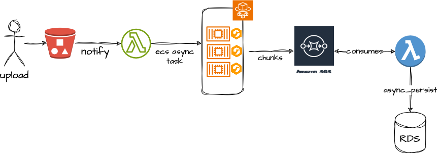
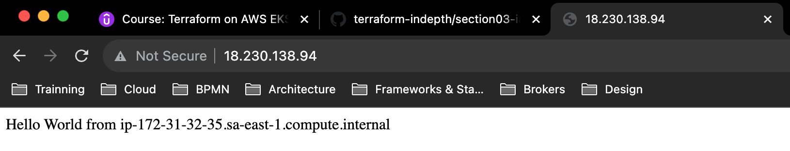
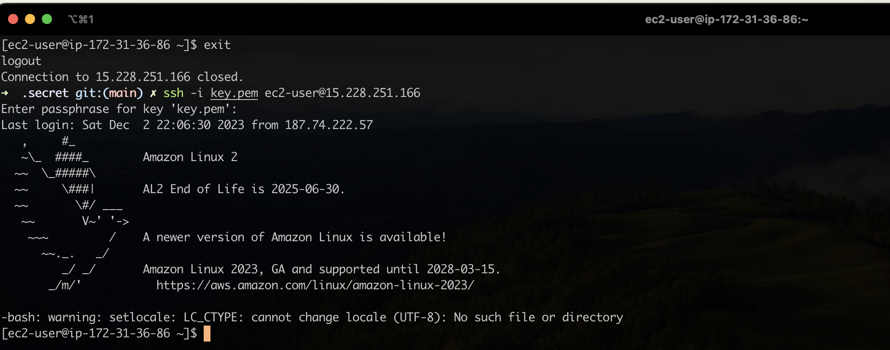

= Terraform on AWS EKS Kubernetes IaC SRE

== Links

- AWS EKS
- Quarkus
- Terraform
- https://camel.apache.org[Apache Camel]
- https://github.com/stacksimplify/terraform-on-aws-eks[Git Repo Course]
- https://developer.hashicorp.com/terraform/tutorials/aws-get-started/install-cli[Install Terraform MacOs]
- https://registry.terraform.io/namespaces/hashicorp[Hashicorp Cloud Providers Version]

== _Section 01_

* _Terraform Fundamentals_
* _Kubernetes Fundamentals_
* _AWS VPC 3-Tier Network_
* _AWS EC2 Bastion Host in Public Subnet_
* _AWS EKS Cluster - Public/Private Nodegroup_
* _Kubernetes Deployment & Service using TF k8s Provider_
* _Terraform Remote state storage using Key concept_
* _EKS IRSA IAM Roles for K8s Service Accounts_
* _Kubernetes Storage: EBS CSI_
* _Kubernetes Storage: EBS EFS_
* _EKS LoadBalancer Controller Ingress_
* _EKS IAM and Fargate_
* _Autoscaling HPA and VPA_
* _EKS Monitoring and Logging Cloudwatch Agent + FluentBit_

[source,bash]
----
aws s3api list-buckets
----

.Terraform Block (https://github.com/stacksimplify/terraform-on-aws-eks/tree/main/03-Terraform-Settings-Providers-Resources/terraform-manifests[Git hub link])
[source,hcl-terraform]
----
terraform {
  required_version = "~> 1.6.5"
  required_providers {
    aws = {
      source  = "hashicorp/aws"
      version = "~> 5.29"
    }
  }
}

provider "aws" {
  region  = var.region
  profile = var.profile
}
----

.Apache Camel/Quarkus on AWS EKS Fargate and S3 File Process with terraform

== Terraform Command Basics

* Terraform workflow

[source,bash]
----
tf init
tf validate
tf plan
tf apply
tf destroy
----

[%header,cols=5*]
|===

|Init
|Validate
|Plan
|Apply
|Destroy

|Used to initialize a working directory containing terraform config files, this command should be run after writing a new TF conf

|Validates the terraform configurations files in that respective directory to ensure they are syntactically valid and internally consistent

|Creates an execution plan TF that performs a refresh and determines what actions are necessary to achieve the desired state specified in conf files

|Used to apply the changes required _to reach the desired state_ of the configuration, by default, apply scan the current directory for the configuration and
apply the changes appropriately

|Destroy command in terraform managed infra, this will ask for confirmations before destroying

|===

- https://github.com/stacksimplify/terraform-on-aws-eks/tree/main/04-Terraform-Variables-and-Datasources[Github link EC2 Instance]

.TF Log4 apply command

link:../sre-eks/section02/ec2/instance.tf[EC2 AWS Instance SSH and HTTP on Public Subnet]

[source,bash]
----
ssh-keygen -f {{PEM_FILE}}.pem
sudo ssh-keygen -e -m RFC4716 -f {{PEM_FILE}}.pem
# external folder access
sudo chmod 600 /path/{{PEM_FILE}}.pem
sudo chmod 755 /path_of_pems
ssh -i {{pem}} ec2-user@{{PUBLIC_IP}}|{{DNS_NAME}}
ssh -i {{pem}} ubuntu@{{PUBLIC_IP}}|{{DNS_NAME}}
----

