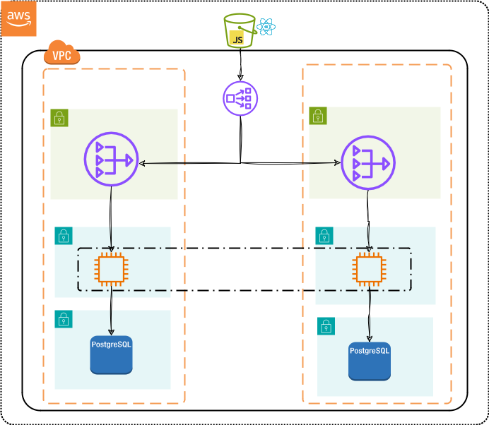
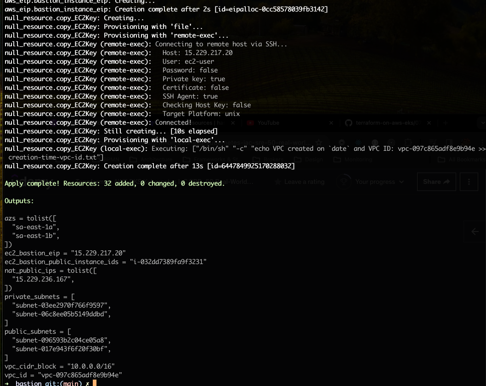
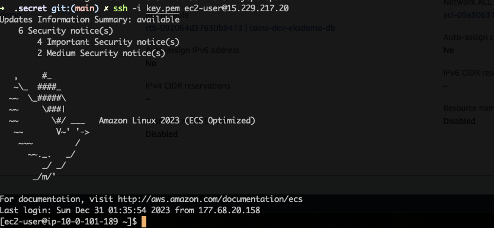
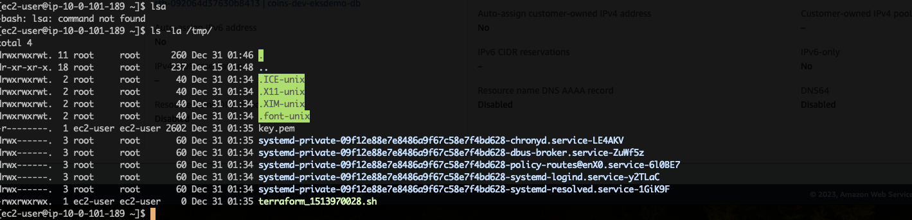
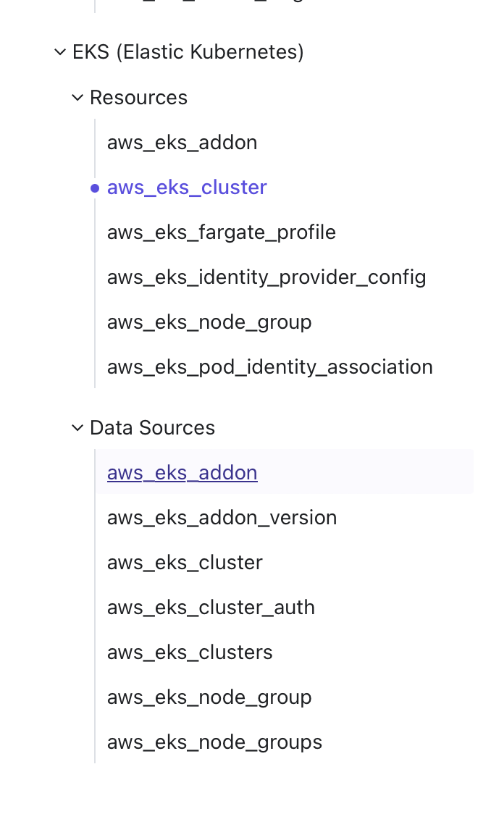
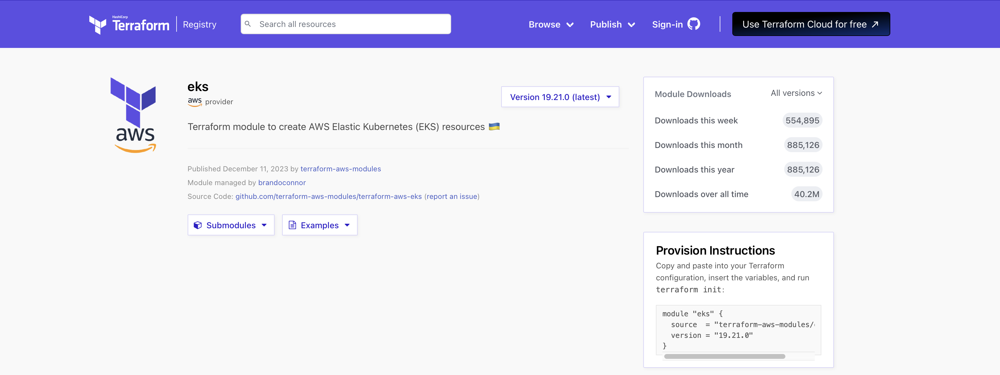

= Terraform on AWS EKS Kubernetes IaC SRE

== Links

- AWS EKS
- Quarkus
- Terraform
- https://camel.apache.org[Apache Camel]
- https://github.com/stacksimplify/terraform-on-aws-eks[Git Repo Course]
- https://developer.hashicorp.com/terraform/tutorials/aws-get-started/install-cli[Install Terraform MacOs]
- https://registry.terraform.io/namespaces/hashicorp[Hashicorp Cloud Providers Version]
- https://docs.aws.amazon.com/eks/latest/userguide/kubernetes-versions.html[Amazon EKS Kubernetes versions]
- https://medium.com/@tech_18484/step-by-step-guide-creating-an-eks-cluster-with-terraform-resources-iam-roles-for-service-df1c5e389811[Creating an EKS Cluster]

== _Section 01_

* _Terraform Fundamentals_
* _Kubernetes Fundamentals_
* _AWS VPC 3-Tier Network_
* _AWS EC2 Bastion Host in Public Subnet_
* _AWS EKS Cluster - Public/Private Nodegroup_
* _Kubernetes Deployment & Service using TF k8s Provider_
* _Terraform Remote state storage using Key concept_
* _EKS IRSA IAM Roles for K8s Service Accounts_
* _Kubernetes Storage: EBS CSI_
* _Kubernetes Storage: EBS EFS_
* _EKS LoadBalancer Controller Ingress_
* _EKS IAM and Fargate_
* _Autoscaling HPA and VPA_
* _EKS Monitoring and Logging Cloudwatch Agent + FluentBit_

[source,bash]
----
aws s3api list-buckets
----

.Terraform Block (https://github.com/stacksimplify/terraform-on-aws-eks/tree/main/03-Terraform-Settings-Providers-Resources/terraform-manifests[Git hub link])
[source,hcl-terraform]
----
terraform {
  required_version = "~> 1.6.5"
  required_providers {
    aws = {
      source  = "hashicorp/aws"
      version = "~> 5.29"
    }
  }
}

provider "aws" {
  region  = var.region
  profile = var.profile
}
----

.Apache Camel/Quarkus on AWS EKS Fargate and S3 File Process with terraform
image::../../thumbs/common/camel-s3-ecs-task-process.png[]

=== Terraform Command Basics

* Terraform workflow

[source,bash]
----
tf init
tf validate
tf plan
tf apply
tf destroy

aws ec2 describe-images --owners amazon --filters "Name=name,Values=amzn*" --query 'sort_by(Images, &CreationDate)[].Name
----

[%header,cols=5*]
|===

|Init
|Validate
|Plan
|Apply
|Destroy

|Used to initialize a working directory containing terraform config files, this command should be run after writing a new TF conf

|Validates the terraform configurations files in that respective directory to ensure they are syntactically valid and internally consistent

|Creates an execution plan TF that performs a refresh and determines what actions are necessary to achieve the desired state specified in conf files

|Used to apply the changes required _to reach the desired state_ of the configuration, by default, apply scan the current directory for the configuration and
apply the changes appropriately

|Destroy command in terraform managed infra, this will ask for confirmations before destroying

|===

[%header,cols=2*]
|===
|Provisioner
|Description

|File Provisioner
|File Provisioner is used to _copy files or directories_ from the _machine executing Terraform_ to the _newly created resource_

|remote-exec Provisioner
|The _remote-exec_ provisioner _invokes a script on a remote resource_ after it is _created_

|local-exec Provisioner
|The _local-exec_ provisioner _invokes a local executable_ after a resource _is created_. This invokes a _process on the machine-running terraform_, not on the resource

|null-resource
|If you need to run provisioners _that aren't directly associated_ with a specific resource, you can associate them with a _null_resource_. Instances of _null_resource_ are treated like normal resources, but they _don't do anything_. Same as other resource, you can configure _provisioners_ and _connection_ _details_ on a _null_resources_.
|===

- https://github.com/stacksimplify/terraform-on-aws-eks/tree/main/04-Terraform-Variables-and-Datasources[Github link EC2 Instance]

.TF Log4 Apply Command

link:../sre-eks/section02/ec2/instance.tf[EC2 AWS Instance SSH and HTTP on Public Subnet]

=== Terraform Provisioners

. Provisioners can be used to model specific actions on the local machine or on a remote machine to prepare servers

[source,bash]
----
ssh-keygen -f {{PEM_FILE}}.pem
sudo ssh-keygen -e -m RFC4716 -f {{PEM_FILE}}.pem
# external folder access
# ssh -i ../../../.secret/key.pem
sudo chmod 400 /path/{{PEM_FILE}}.pem
sudo chmod 600 /path/{{PEM_FILE}}.pem
sudo chmod 755 /path_of_pems
ssh -i {{pem}} ec2-user@{{PUBLIC_IP}}|{{DNS_NAME}}
ssh -i {{pem}} ubuntu@{{PUBLIC_IP}}|{{DNS_NAME}}
----

== Section05

.List and Maps
[source,hcl-terraform]
----
variable "my_list" {
  type = list(string)
  default = ["t3.micro", "t3.small"]
}

variable "my_map" {
  type = map(string)
  default = {
    "dev" = "t3.micro"
    "qa"  = "t3.small"
    "prod" = "t3.large"
  }
}

resource "my_instance" {
  instance_type = var.my_list[1] # t3.small
  instance_type = var.my_map["prod"] # t3.large

  tags = {
    name = "satanindepth-${count.index}"
  }
}
----

.Loops
[source,hcl-terraform]
----
output "for_output_list" {
  description = "For Loop with List"
  value = [for inst in aws_instance.my_instance: inst.public_dns]
}

output "for_output_map1" {
  description = "For Loop with Map"
  value = {for inst in aws_instance.my_instance: inst.id => inst.public_dns}
}

output "for_output_map2" {
  description = "For Loop with Map - Advanced"
  value = {for c, inst in aws_instance.my_instance: c => inst.public_dns}
}
----

.Datasource's and for_each Meta-Argument
[source,hcl-terraform]
----
data "aws_availability_zones" "zones" {
  filter {
    name = "opt-in-status"
    values = ["opt-in-not-required"]
  }
}
# data.aws_availability_zones.zones.names

resource "my_instance" {
  instance_type = var.my_list[1] # t3.small
  instance_type = var.my_map["prod"] # t3.large
  for_each = toset(data.aws_availability_zones.zones.names)
  availability_zone = each.key
  tags = {
    name = "satanindepth-${each.key}"
  }
}

output "for_output_list" {
  description = "For Loop with List"
  value = toset([for inst in aws_instance.my_instance: inst.public_ip])
}

output "for_output_map2" {
  description = "For Loop with Map - Advanced"
  value = tomap({for az, inst in aws_instance.my_instance: az => inst.public_dns})
}
----

[source,bash]
----
aws ec2 describe-instance-type-offerings --location-type availability-zone --filters Name=instance-type,Values=t3.micro --region sa-east-1 --output table
----

.Datasource Filtering EC2 instances in Specific Zone (final sample)
[source,hcl-terraform]
----
data "aws_availability_zones" "zones" {
  filter {
    name = "opt-in-status"
    values = ["opt-in-not-required"]
  }
}
data "describe-instance-type-offerings" "my_instance_filter" {
  for_each = data.aws_availability_zones.zones.names
  filter {
    name = "instance-type"
    values = ["t3.micro"]
  }
  filter {
    name = "location"
    values = [each.key]
  }
  location_type = "availability-zone"
}

output "output_v1_1" {
  #value = data.describe-instance-type-offerings.my_instance_filter.instance_types
  value = toset([for t in data.describe-instance-type-offerings.my_instance_filter: t.instance_types])
}
# map Key:Value sa-east-1: t3.micro
output "output_v1_2" {
  value = keys({
    for az, detail in data.describe-instance-type-offerings.my_instance_filter: az => detail.instance_types if length(detail.instance_types) != 0
  })#[0]
}
resource "my_instance" {
  instance_type = var.my_list[1] # t3.small
  instance_type = var.my_map["prod"] # t3.large
  for_each = toset(keys({
    for az, detail in data.describe-instance-type-offerings.my_instance_filter: az => detail.instance_types if length(detail.instance_types) != 0
  }))
  availability_zone = each.key
  tags = {
    name = "meho-${each.key}"
  }
}
----

=== AWS VPC 3 tier Architecture

.3Tier APP v1

=== Terraform Modules

* Modules are _containers for multiple resources_ that are used together.
A module consists of a collection of _.tf_ files kept together in a directory

.Terraform .-var-file argument without .auto option
[source,bash]
----
tf plan/apply -var-file {{file.tfvars}}
----

=== AWS EC2 Bastion Host

.Ec2 Bastion Instance and Null-resource

.Ec2 Bastion Instance Connected

.Ec2 Bastion /tmp Directory

=== EKS Introduction Basics

.AWS EKS Resources in High level (Pre-requisites Resource and EKS Workload)
[%header,cols=4*]
|===
|VPC
|Bastion Host
|EKS Cluster
|EKS Node group

|Subnets (Public/Private)
|Bastion Host EC2 Instance
|EKS Cluster IAM Roles
|EKS Node Group IAM Role

|Route Tables
|Bastion Host SG
|EKS Cluster SGs
|EKS Node Group SGs

|Nat Gateway + EIP
|Bastion Host EIP
|EKS Network Interface
|EKS Node Group Network Interface

|Internet Gateway
|N/A
|EKS Cluster
|EKS Work Nodes EC2 Instances

|===

